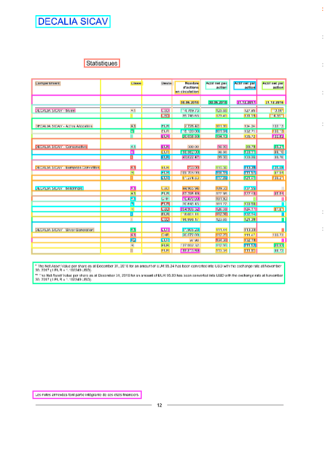

<p align="center">
  
  <h3 align="center">
  A Document AI Package
  </h3>
</p>


**deep**doctection is a Python package that enables document analysis pipelines to be built using deep learning models.

Extracting information from documents is difficult. Documents often have a complex visual structure and the information 
they contain is not tagged. **deep**doctection is a tool box that is intended to facilitate entry into this topic. 

Parse your document by detecting layout structures like tables with full table semantics (cells, rows, columns), 
get text in reading order with OCR, detect language and do many other things.

The focus should be on application. **deep**doctection is made for data scientists who are tasked with supporting
departments in process optimization or for analysts who have to investigate into large sets of documents.

For further text processing tasks, use one of the many other great NLP libraries.



## Characteristics

1. Use an **off the shelf analyzer** for restructuring your **PDF** or **scanned documents**:
         
   - layout recognition with deep neural networks (Cascade-RCNN and more) trained on large public datasets
   - table extraction with full table semantics (rows, columns, multi line cell spans), again with help of Cascade-RCNN
   - OCR or text mining with  [Tesseract](https://github.com/tesseract-ocr/tesseract), 
     [DocTr](https://github.com/mindee/doctr) or [pdfplumber](https://github.com/jsvine/pdfplumber)
   - reading order
   - language detection with [fastText](https://github.com/facebookresearch/fastText)
   - parsed output available as JSON object for further NLP tasks

Off the shelf actually means off the shelf. The results will look okay, but useful outputs for downstream tasks will 
only come out when models are adapted to actual documents you deal with. Therefore:

2. **Fine-tune pre-trained DNN** on your own labeled dataset. Use generally acknowledged metrics for evaluating training
    improvements.


3. **Compose your document analyzer** by choosing a model and plug it into your own pipeline. For example, you can use
    pdfplumber if you have native PDF documents. Or you can benchmark OCR results with AWS Textract (account needed and 
    paid service).


5. Wrap DNNs from open source projects into the **deep**doctections API and **enrich your pipeline easily with SOTA 
   models**.


6. All models are now available at the :hugs: [**Huggingface Model Hub**](https://huggingface.co/deepdoctection) .
You can acquire more details in the respective model cards.

Check [**this notebook**](./notebooks/Get_Started.ipynb) for an easy start, as  well as the full
[**documentation**](https://deepdoctection.readthedocs.io/en/latest/index.html#).

## Requirements

### Platform and Python

Before you start, please ensure your installation fulfills the following baseline requirements:

- Linux **or** macOS
- Python >=  3.8 
- PyTorch >= 1.8 and torchvision **or** Tensorflow >=2.4.1 and CUDA

Windows is not supported.

You can run on PyTorch with a CPU only. For Tensorflow a GPU is required. 

**deep**doctection uses [**Tensorpack**](https://github.com/tensorpack) as training framework as well as its vision 
models for layout analysis. For PyTorch, [**Detectron2**](https://github.com/facebookresearch/detectron2) is used. 
All models have been trained on Tensorflow and converted into Detectron2 consumable artefacts. If you want to train, 
please use the Tensorflow framework. 

Besides these models, **deepdoctection** has wrappers available to use models for inference in pipelines from different 
libraries. 

### Other

**deep**doctection uses Python wrappers for [Poppler](https://poppler.freedesktop.org/) to convert PDF documents into 
images and for calling [Tesseract](https://github.com/tesseract-ocr/tesseract) OCR engine. 
If you get started and want to run the notebooks for the first time it is required to have them installed as well.

## Installation

We recommend using a virtual environment. You can install the package via pip or from source. 

### Install with pip

[Dataflow](https://github.com/tensorpack/dataflow) is not available on the pypi server and must be installed separately.

```
pip install  "dataflow @ git+https://github.com/tensorpack/dataflow.git"
```

Depending on which Deep Learning library is available, use the following installation option:

For **Tensorflow**, run

```
pip install deepdoctection[tf]
```

For **PyTorch**, first install **Detectron2** separately as it is not on the pypi server, either. Check the instruction 
[here](https://detectron2.readthedocs.io/en/latest/tutorials/install.html). Then run

```
pip install deepdoctection[pt]
```

This will install the basic setup which is needed to run the first two notebooks and do some inference with pipelines.

**Please note:** Prediction results in PyTorch are worse and suffer from bounding boxes shifted to the right. 
This becomes visible when visualising the page of the demo notebook which is displayed in high resolution 
(e.g. approx. 2000/3000 pixels). This model has been mainly added for demo purposes without the need of a GPU. 
When accurate models a needed, please use the Tensorflow version.

Some libraries are not added to the requirements in order to keep the dependencies as small as possible (e.g. DocTr,
pdfplumber, fastText, ...). If you want to use them, you have to pip install them by yourself.

<!--- uncomment for next release
To use more features (e.g. run all available notebooks), try:

```
pip install deepdoctection[full-tf]
```

Note, that this option is not available for PyTorch.
--->


### Installation from source

Download the repository or clone via

```
git clone https://github.com/deepdoctection/deepdoctection.git
```

To get started with **Tensorflow**, run:

```
cd deepdoctection
pip install ".[source-tf]"
```

or with **PyTorch**:
 
```
cd deepdoctection
pip install ".[source-pt]"
```

This will install the basic dependencies to get started with the first notebooks. More libraries can be
used, once more dependencies have been installed: 

```
cd deepdoctection
pip install ".[source-all-tf]"
```

or 

```
cd deepdoctection
pip install ".[source-all-pt]"
```

installs all available external libraries that can be used for inference (e.g. DocTr, pdfplumber, fastText, ...).

For more installation options check [**this**](https://deepdoctection.readthedocs.io/en/latest/manual/install.html) site.


## Credits

Many utils, concepts and some models are inspired and taken from [**Tensorpack**](https://github.com/tensorpack) . 
We heavily make use of [Dataflow](https://github.com/tensorpack/dataflow) for loading and streaming data.  


## Problems

We try hard to eliminate bugs. We also know that the code is not free of issues. We welcome all issues relevant to this
repo and try to address them as quickly as possible.


## Citing **deep**doctection

If you use **deep**doctection in your research or in your project, please cite:

```
@misc{jmdeepdoctection,
  title={deepdoctection},
  author={Meyer, Dr. Janis and others},
  howpublished={\url{https://github.com/deepdoctection/deepdoctection}},
  year={2021}
}
```


## License

Distributed under the Apache 2.0 License. Check [LICENSE](https://github.com/deepdoctection/deepdoctection/blob/master/LICENSE) 
for additional information.
