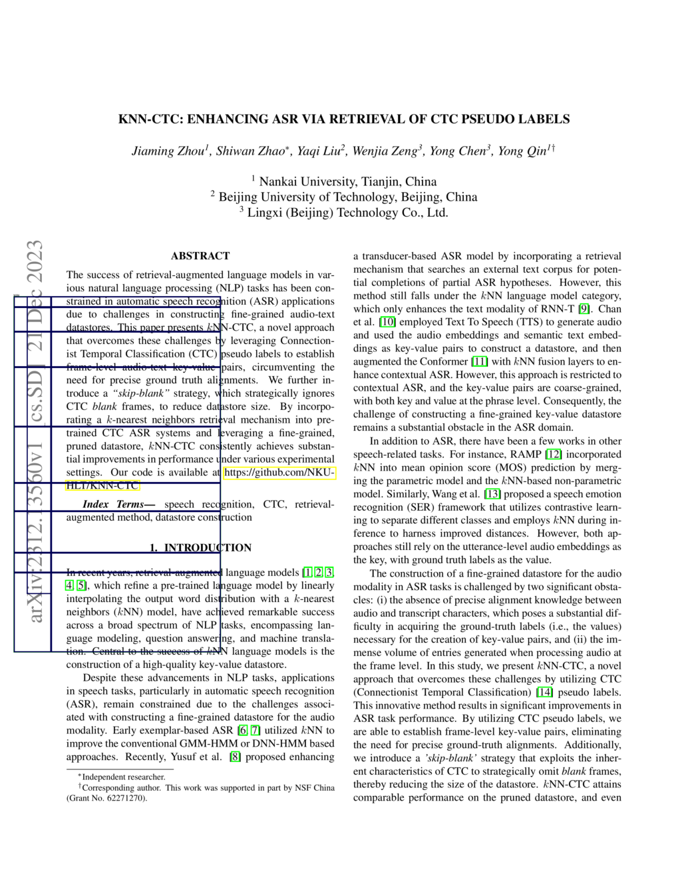
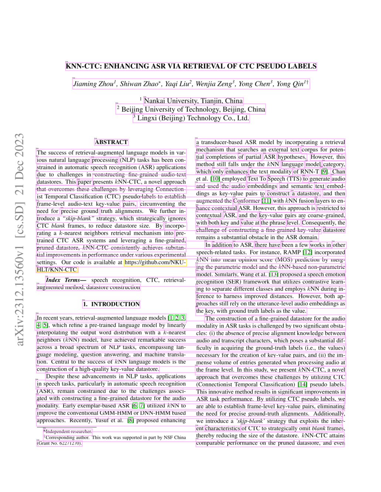
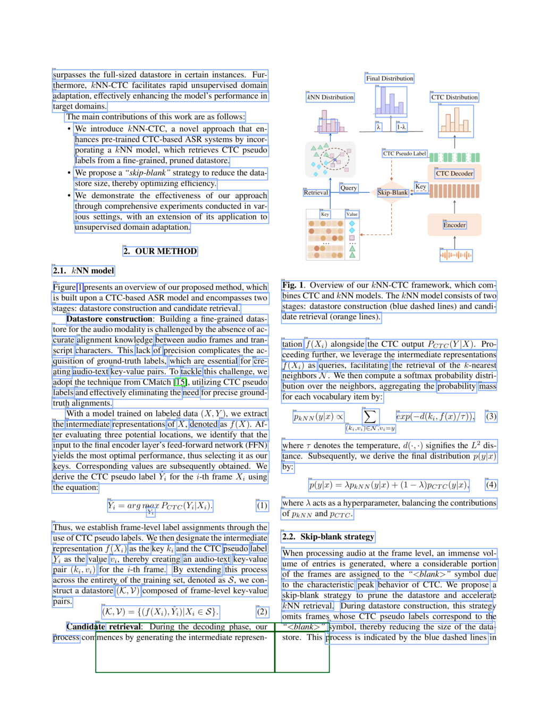
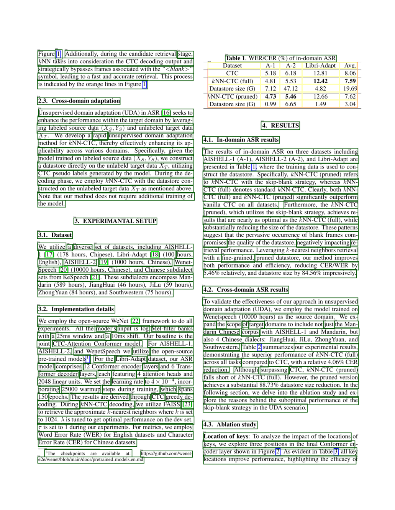
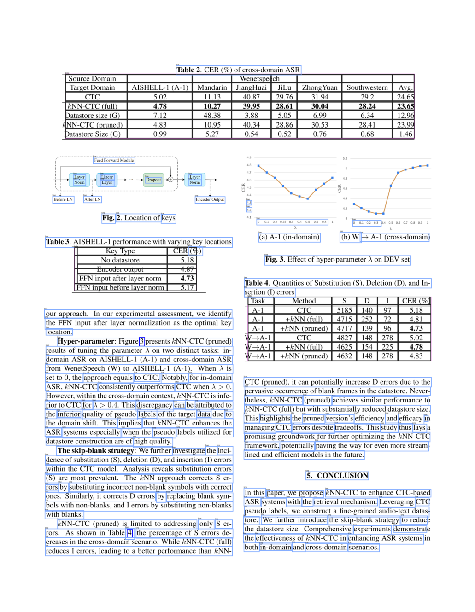
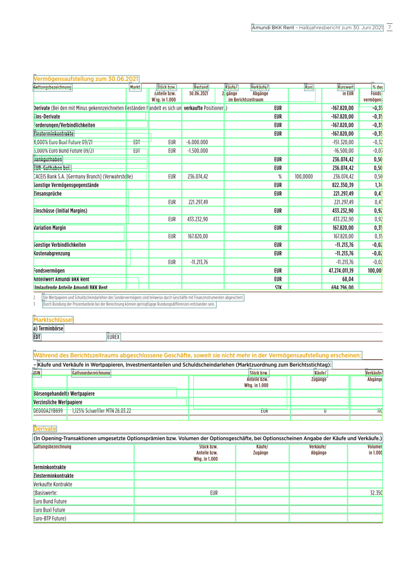

# Analyzer configuration for running Table Transformer


In this notebook, we demonstrate how the [Table Transformer](https://github.com/microsoft/table-transformer) models can be utilized for table detection and table segmentation by adjusting the analyzer's default configuration. 

Additionally, we illustrate that modifying downstream parameters might be beneficial as well. We start from the default configuration and improve the quality of page parsing only by changing some processing parameters. The chosen configurations in this notebook may not be optimal, and we recommend continuing experimentation with the parameters, especially if fine-tuning models is not an option.

## General configuration


```python
import os

os.environ["USE_DD_PILLOW"]="True"
os.environ["USE_DD_OPENCV"]="False"

import deepdoctection as dd
from matplotlib import pyplot as plt
from IPython.core.display import HTML
```


```python

path="/path/to/dir/sample/2312.13560.pdf" # Use the PDF in the sample folder
    
analyzer =dd.get_dd_analyzer(config_overwrite=
   ["PT.LAYOUT.WEIGHTS=microsoft/table-transformer-detection/pytorch_model.bin",   # TATR table detection model
    "PT.ITEM.WEIGHTS=microsoft/table-transformer-structure-recognition/pytorch_model.bin",  # TATR table segmentation model
    "PT.ITEM.FILTER=['table']",
    "OCR.USE_DOCTR=True",  # we disable Tesseract and use DocTr as OCR engine
    "OCR.USE_TESSERACT=False",
                        ])
```

The first configuration replaces the default layout and segmentation models with the registered table transformer models. The values need to be the equal to the model names in the `ModelCatalog`. You can find all registered model with `ModelCatalog.get_profile_list()`.

The table recognition model identifies tables again from cropped table regions. This is irrelevant for processing and actually leads to errors. For this reason, category `table` must be filtered out.

```yaml
PT:
   LAYOUT:
      WEIGHTS: microsoft/table-transformer-detection/pytorch_model.bin
   ITEM:
      WEIGHTS: microsoft/table-transformer-structure-recognition/pytorch_model.bin
      FILTER:
         - table
```


```python
df = analyzer.analyze(path=path)
df.reset_state()
dp = next(iter(df))

np_image = dp.viz()

plt.figure(figsize = (25,17))
plt.axis('off')
plt.imshow(np_image)
```

    [1229 17:17.27 @doctectionpipe.py:84]  INF  Processing 2312.13560_0.pdf
    [1229 17:17.28 @context.py:126]  INF  ImageLayoutService total: 0.3408 sec.
    [1229 17:17.28 @context.py:126]  INF  SubImageLayoutService total: 0.0634 sec.
    [1229 17:17.28 @context.py:126]  INF  PubtablesSegmentationService total: 0.0087 sec.
    [1229 17:17.29 @context.py:126]  INF  ImageLayoutService total: 0.3084 sec.
    [1229 17:17.29 @context.py:126]  INF  TextExtractionService total: 0.6876 sec.
    [1229 17:17.29 @context.py:126]  INF  MatchingService total: 0.0045 sec.
    [1229 17:17.29 @context.py:126]  INF  TextOrderService total: 0.0086 sec.


    

    


```python
dp.tables[0].csv
```


    [[' ', 'strained in automatic speech '],
     [' ', 'due to challenges in constructing datastores. This paper presents '],
     [' ', 'that overcomes these challenges ist Temporal Classification (CTC) '],
     ['',
      'key-value need for precise ground truth troduce a "skip-blank - strategy, CTC blank frames, to reduce rating a k-nearest neighbors '],
     ['',
      'trained CTC ASR systems and pruned datastore, KNN-CTC tial improvements in performance settings. Our code is available at '],
     ['', 'HLT/KNN-CTC Index Terms- speech '],
     ['', 'augmented method, datastore 1. '],
     [' ', ' '],
     [' ',
      'years, 45), which refine a pre-trained interpolating the output word neighbors (KNN) model, have across a broad spectrum of NLP guage modeling, question answering, ']]


```python
dp.tables[0].score
```


    0.3333275020122528


```python
dp.text
```


    ''


Okay, table detection doesn't work at all. Besides that, we see that no text is recognized outside of the table. To suppress this poor table region prediction, we are increasing the filter confidence score to 0.4. We cannot change this directly in the `analyzer` configuration. 

The surrounding text is not displayed because the configuration only outputs the text within a layout segment. In this case, these are only tables. If we set `TEXT_ORDERING.INCLUDE_RESIDUAL_TEXT_CONTAINER=True`, line layout segments will be generated for all words, and all all line segments will be taken into account when generating narrative text.


```python
path="/path/to/dir/sample/2312.13560.pdf" # Use the PDF in the sample folder
    
analyzer =dd.get_dd_analyzer(config_overwrite=
   ["PT.LAYOUT.WEIGHTS=microsoft/table-transformer-detection/pytorch_model.bin",
    "PT.ITEM.WEIGHTS=microsoft/table-transformer-structure-recognition/pytorch_model.bin",
    "PT.ITEM.FILTER=['table']",
    "OCR.USE_DOCTR=True",
    "OCR.USE_TESSERACT=False",
    "TEXT_ORDERING.INCLUDE_RESIDUAL_TEXT_CONTAINER=True",
                        ])

analyzer.pipe_component_list[0].predictor.config.threshold = 0.4  # default threshold is at 0.1

df = analyzer.analyze(path=path)
df.reset_state()
dp = next(iter(df))

np_image = dp.viz()
```


```python
plt.figure(figsize = (25,17))
plt.axis('off')
plt.imshow(np_image)
```


    <matplotlib.image.AxesImage at 0x7fed0f58bf10>


    

    


```python
print(dp.text)
```

    KNN-CTC: ENHANCING ASR VIA RETRIEVAL OF CTC PSEUDO LABELS
    Jiaming Zhou', Shiwan Zhao*, Yaqi Liu, Wenjia Zeng, Yong Chen, Yong Qin't
    Nankai University, Tianjin, China
    2 Beijing University of Technology, Beijing, China
    3 Lingxi (Beijing) Technology Co., Ltd.
    ABSTRACT
    a transducer-based ASR model by incorporating a retrieval
    mechanism that searches an external text
    corpus for poten-
    The success of retrieval-augmented language models in var-
    tial
    completions partial
    of
    ASR
    hypotheses.
    However, this
    ious natural language
    processing
    (NLP) tasks has been con-
    method still falls under the KNN
    language
    model
    category,
    strained in automatic speech recognition (ASR) applications
    which
    only
    enhances
    the text modality
    of RNN-T Chan
    9.
    due to challenges in constructing fine-grained audio-text
    presents KNN-CTC, a novel approach etal. IOJ employed
    Text To
    Speech (TTS) generate
    audio
    datastores. This
    paper
    to
    and used audio
    the
    embeddings
    and semantic embed-
    text
    ist Temporal Classification (CTC) pseudo labels to establish dings as key-value pairs to
    that overcomes these challenges by leveraging Connection-
    and then
    construct datastore,
    a
    circumventing the augmented the
    Conformer with KNN fusion
    I
    layers to en-
    frame-level audio-text key-value
    pairs,
    ASR. However, this approach is
    need for
    precise ground
    truth alignments. We further in-
    hance contextual
    restricted to
    contextual
    ASR,
    and the
    key-value pairs are coarse-grained,
    troduce a "skip-blank - strategy, which strategically ignores
    with key and
    both
    the phrase
    level.
    Consequently, the
    CTC blank frames, to reduce datastore size. By
    incorpo-
    value at
    challenge of constructing a fine-grained key-value
    datastore
    rating a k-nearest neighbors retrieval mechanism into
    pre- remains a substantial obstacle in the ASR domain.
    trained CTC ASR systems and leveraging a fine-grained,
    In
    addition
    to ASR,
    there have
    been a few
    works in
    other
    pruned datastore, KNN-CTC consistently achieves substan-
    tial improvements in performance under various experimental speech-related tasks. For instance, RAMP 12) incorporated
    settings. Our code is available at htpsy/gthubcomNKU: kNN into mean opinion score (MOS) prediction by merg-
    HLT/KNN-CTC
    ing the parametric model and the KNN-based non-parametric
    model. Similarly, Wang et al. 13) proposed a speech emotion
    Index Terms- speech recognition, CTC, retrieval- recognition (SER) framework that utilizes contrastive learn-
    augmented method, datastore construction
    ing to separate different classes and employs KNN during in-
    ference to harness improved distances. However, both ap-
    1. INTRODUCTION
    proaches still rely on the utterance-level audio embeddings as
    the key, with ground truth labels as the value.
    In recent years, retrieval-augmented language models 123
    The construction of a fine-grained datastore for the audio
    45), which refine a pre-trained language model by linearly modality in ASR tasks is challenged by two significant obsta-
    interpolating the output word distribution with a k-nearest cles: (i) the absence of precise alignment knowledge between
    neighbors (KNN) model, have achieved remarkable success audio and transcript characters, which poses a substantial dif-
    across a broad spectrum of NLP tasks, encompassing lan- ficulty in acquiring the ground-truth labels (i.e., the values)
    guage modeling, question answering, and machine transla- necessary for the creation of key-value pairs, and (i) the im-
    tion. Central to the success of KNN language models is the mense volume of entries generated when processing audio at
    construction of a high-quality key-value datastore.
    the frame level. In this study, we present KNN-CTC, a novel
    Despite these advancements in NLP tasks, applications approach that overcomes these challenges by utilizing CTC
    in speech tasks, particularly in automatic speech recognition (Connectionist Temporal Classification) (41 pseudo labels.
    (ASR), remain constrained due to the challenges associ- This innovative method results in significant improvements in
    ated with constructing a fine-grained datastore for the audio ASR task performance. By utilizing CTC pseudo labels, we
    modality. Early exemplar-based ASR 67 utilized KNN to are able to establish frame-level key-value pairs, eliminating
    improve the conventional GMM-HMM or DNN-HMM based the need for precise ground-truth alignments. Additionally
    approaches. Recently, Yusuf et al. 81 proposed enhancing we introduce a 'skip-blank' strategy that exploits the inher
    ent
    characteristics
    of CTC to strategically omit blank frames
    *Independent researcher.
    tCorresponding author. This work was supported in part by NSF China thereby reducing the size of the datastore. KNN-CTC attains
    (Grant No. 62271270).
    comparable performance on the pruned datastore, and even
    


The result is not much better. Although we are able to retrieve text outside tables, we observe that the text lines span across multiple columns. This leads to a disastrous outcome in terms of reading order. 

The construction of text lines is done heuristically. In particular, it is determined when adjacent words belong to the same text line and when text lines need to be separated, even if they are at the same horizontal level. 

By reducing the value of `TEXT_ORDERING.PARAGRAPH_BREAK`, we can achieve the splitting of text lines as soon as the word boxes exceed a minimum distance.


```python
path="/path/to/dir/sample/2312.13560.pdf" # Use the PDF in the sample folder
    
analyzer =dd.get_dd_analyzer(config_overwrite=
   ["PT.LAYOUT.WEIGHTS=microsoft/table-transformer-detection/pytorch_model.bin",
    "PT.ITEM.WEIGHTS=microsoft/table-transformer-structure-recognition/pytorch_model.bin",
    "PT.ITEM.FILTER=['table']",
    "OCR.USE_DOCTR=True",
    "OCR.USE_TESSERACT=False",
    "TEXT_ORDERING.INCLUDE_RESIDUAL_TEXT_CONTAINER=True",
    "TEXT_ORDERING.PARAGRAPH_BREAK=0.01",  # default value is at 0.035 which might be too large
                        ])

analyzer.pipe_component_list[0].predictor.config.threshold = 0.4

df = analyzer.analyze(path=path)
df.reset_state()
df_iter = iter(df)
```


```python
dp = next(df_iter)
np_image = dp.viz()

plt.figure(figsize = (25,17))
plt.axis('off')
plt.imshow(np_image)
```

    [1229 17:17.51 @doctectionpipe.py:84]  INF  Processing 2312.13560_0.pdf
    [1229 17:17.52 @context.py:126]  INF  ImageLayoutService total: 0.0914 sec.
    [1229 17:17.52 @context.py:126]  INF  SubImageLayoutService total: 0.0 sec.
    [1229 17:17.52 @context.py:126]  INF  PubtablesSegmentationService total: 0.0 sec.
    [1229 17:17.52 @context.py:126]  INF  ImageLayoutService total: 0.3113 sec.
    [1229 17:17.53 @context.py:126]  INF  TextExtractionService total: 0.5867 sec.
    [1229 17:17.53 @context.py:126]  INF  MatchingService total: 0.0027 sec.
    [1229 17:17.53 @context.py:126]  INF  TextOrderService total: 0.143 sec.


    

    


```python
print(dp.text)
```

    KNN-CTC: ENHANCING ASR VIA RETRIEVAL OF CTC PSEUDO LABELS
    Jiaming Zhou', Shiwan Zhao*, Yaqi Liu, Wenjia Zeng, Yong Chen, Yong Qin't
    Nankai University, Tianjin, China
    2 Beijing University of Technology, Beijing, China
    3 Lingxi (Beijing) Technology Co., Ltd.
    ABSTRACT
    The success of retrieval-augmented language models in var-
    ious natural language
    processing
    (NLP) tasks has been con-
    strained in automatic speech recognition (ASR) applications
    due to challenges in constructing fine-grained audio-text
    datastores. This
    paper
    presents KNN-CTC, a novel approach
    that overcomes these challenges by leveraging Connection-
    ist Temporal Classification (CTC) pseudo labels to establish
    frame-level audio-text key-value
    pairs,
    circumventing the
    need for
    precise ground
    truth alignments. We further in-
    troduce a "skip-blank - strategy, which strategically ignores
    CTC blank frames, to reduce datastore size. By
    incorpo-
    rating a k-nearest neighbors retrieval mechanism into
    pre-
    trained CTC ASR systems and leveraging a fine-grained,
    pruned datastore, KNN-CTC consistently achieves substan-
    tial improvements in performance under various experimental
    settings. Our code is available at htpsy/gthubcomNKU:
    HLT/KNN-CTC
    Index Terms-
    speech recognition, CTC, retrieval-
    augmented method, datastore construction
    1. INTRODUCTION
    In recent years, retrieval-augmented language models 123
    45), which refine a pre-trained language model by linearly
    interpolating the output word distribution with a k-nearest
    neighbors (KNN) model, have achieved remarkable success
    across a broad spectrum of NLP tasks, encompassing lan-
    guage modeling, question answering, and machine transla-
    tion. Central to the success of KNN language models is the
    construction of a high-quality key-value datastore.
    Despite these advancements in NLP tasks, applications
    in speech tasks, particularly in automatic speech recognition
    (ASR), remain constrained due to the challenges associ-
    ated with constructing a fine-grained datastore for the audio
    modality. Early exemplar-based ASR 67 utilized KNN to
    improve the conventional GMM-HMM or DNN-HMM based
    approaches. Recently, Yusuf et al. 81 proposed enhancing
    *Independent researcher.
    tCorresponding author. This work was supported in part by NSF China
    (Grant No. 62271270).
    a transducer-based ASR model by incorporating a retrieval
    mechanism that searches an external text
    corpus for poten-
    tial
    completions
    of
    partial
    ASR
    hypotheses.
    However, this
    method still falls under the KNN
    language
    model
    category,
    which
    only
    enhances
    the text modality
    of RNN-T
    9.
    Chan
    etal. IOJ employed
    Text To
    Speech (TTS)
    audio
    to
    generate
    and used
    the
    audio
    embeddings
    and semantic
    text
    embed-
    dings as key-value pairs to
    and then
    construct
    a
    datastore,
    augmented the
    Conformer
    I
    with KNN fusion
    layers to en-
    ASR. However, this approach is
    hance contextual
    restricted to
    contextual
    ASR,
    and the
    key-value pairs are coarse-grained,
    with
    both
    key and
    the phrase
    level.
    Consequently, the
    value at
    challenge of constructing a fine-grained key-value
    datastore
    remains a substantial obstacle in the ASR domain.
    In
    addition
    to ASR,
    there have
    been a few
    works in
    other
    speech-related tasks. For instance, RAMP 12) incorporated
    kNN into mean opinion score (MOS) prediction by merg-
    ing the parametric model and the KNN-based non-parametric
    model. Similarly, Wang et al. 13) proposed a speech emotion
    recognition (SER) framework that utilizes contrastive learn-
    ing to separate different classes and employs KNN during in-
    ference to harness improved distances. However, both ap-
    proaches still rely on the utterance-level audio embeddings as
    the key, with ground truth labels as the value.
    The construction of a fine-grained datastore for the audio
    modality in ASR tasks is challenged by two significant obsta-
    cles: (i) the absence of precise alignment knowledge between
    audio and transcript characters, which poses a substantial dif-
    ficulty in acquiring the ground-truth labels (i.e., the values)
    necessary for the creation of key-value pairs, and (i) the im-
    mense volume of entries generated when processing audio at
    the frame level. In this study, we present KNN-CTC, a novel
    approach that overcomes these challenges by utilizing CTC
    (Connectionist Temporal Classification) (41 pseudo labels.
    This innovative method results in significant improvements in
    ASR task performance. By utilizing CTC pseudo labels, we
    are able to establish frame-level key-value pairs, eliminating
    the need for precise ground-truth alignments. Additionally
    we introduce a 'skip-blank' strategy that exploits the inher
    ent
    characteristics
    of CTC to strategically omit blank frames
    thereby reducing the size of the datastore. KNN-CTC attains
    comparable performance on the pruned datastore, and even
    


Okay, this page looks good now. Let's continue scrolling through the document.


```python
dp = next(df_iter)
np_image = dp.viz()

plt.figure(figsize = (25,17))
plt.axis('off')
plt.imshow(np_image)
```

    [1229 17:18.39 @doctectionpipe.py:84]  INF  Processing 2312.13560_1.pdf
    [1229 17:18.40 @context.py:126]  INF  ImageLayoutService total: 0.1056 sec.
    [1229 17:18.40 @context.py:126]  INF  SubImageLayoutService total: 0.0572 sec.
    [1229 17:18.40 @context.py:126]  INF  PubtablesSegmentationService total: 0.0035 sec.
    [1229 17:18.40 @context.py:126]  INF  ImageLayoutService total: 0.2711 sec.
    [1229 17:18.41 @context.py:126]  INF  TextExtractionService total: 0.5125 sec.
    [1229 17:18.41 @context.py:126]  INF  MatchingService total: 0.0036 sec.
    [1229 17:18.41 @context.py:126]  INF  TextOrderService total: 0.0955 sec.


    

    


Once again, we observe a false positive, this time with an even higher confidence threshold. We are not going to increase the threshold, though.


```python
dp.tables[0].score
```


    0.6379920840263367


```python
print(dp.text)
```

    surpasses the full-sized datastore in certain instances. Fur-
    thermore, KNN-CTC facilitates rapid unsupervised domain
    adaptation, effectively enhancing the model's performance in
    target domains.
    The main contributions of this work are as follows:
    We introduce KNN-CTC, a novel approach that en-
    hances pre-trained CTC-based ASR systems by incor-
    porating a KNN model, which retrieves CTC pseudo
    labels from a fine-grained, pruned datastore.
    We propose a "skip-blank" strategy to reduce the data-
    store size, thereby optimizing efficiency.
    We demonstrate the effectiveness of our approach
    through comprehensive experiments conducted in var-
    ious settings, with an extension of its application to
    unsupervised domain adaptation.
    2. OUR METHOD
    2.1. KNN model
    Figurepresents an overview of our proposed method, which
    is built upon a CTC-based ASR model and encompasses two
    stages: datastore construction and candidate retrieval.
    Datastore construction: Building a fine-grained datas-
    tore for the audio modality is challenged by the absence ofac-
    curate
    alignment knowledge
    between audio frames and tran-
    script
    characters. This
    lack
    of
    precision complicates the ac-
    quisition of ground-truth labels,
    which are essential
    for
    cre-
    ating
    audio-text
    key-value pairs. To
    tackle
    this challenge, we
    adopt the technique from CMatch 15), utilizing CTC pseudo
    labels
    and effectively eliminating the
    need
    for precise ground-
    truth alignments.
    With a model trained on labeled data (X,Y), we extract
    the
    intermediate
    representations
    of
    X,
    denoted
    as f(X). Af-
    ter evaluating three potential locations, we identify that the
    input to the final encoder layer's feed-forward network (FFN)
    yields the most optimal performance, thus selecting it as our
    keys. Corresponding values are subsequently obtained. We
    derive the CTC pseudo label Pi for the i-th frame Xi using
    the equation:
    K= argma. PcTC(YX:).
    (1)
    Yi
    Thus, we establish frame-level label assignments through the
    useofCTC pseudo labels. We then designate the intermediate
    representation f(Xi)
    as the
    key ki
    and the CTC
    pseudo
    label
    Yi as the
    value
    Vi, thereby creating
    an audio-text
    key-value
    pair (ki,vi)
    for the i-th frame.
    By extending
    this process
    across the entirety of the training set, denoted as S, we con-
    struct a datastore
    (K,V)
    composed of frame-level key-value
    pairs.
    (K,V)= (((X,9X,ES).
    (2)
    Candidate
    process
    Encoder
    mapa
    Fig. 1. Overview of our KNN-CTC framework, which com-
    bines CTC and KNN models. The KNN model consists of two
    stages: datastore construction (blue dashed lines) and candi-
    date retrieval (orange lines).
    tation
    f(X:) alongside
    the CTC output PCTC(YIx). Pro-
    ceeding further, we leverage the intermediate representations
    f(Xi) as
    queries, facilitating
    the retrieval of the k-nearest
    neighbors N. We then compute a softmax probability distri-
    bution over the neighbors, aggregating the
    probability
    mass
    for each vocabulary item by:
    PKNN(yla) X
    L
    erpl-dk.F(a)/r),
    (3)
    (K:,V)ENEy
    where T denotes the temperature, d() signifies the I2 dis-
    tance. Subsequently, we derive the final distribution P(ylz)
    by:
    p(glz) = ApkNN(yz) + (1- A)pcrc(y/z),
    (4)
    where A acts as a hyperparameter, balancing the contributions
    of PkNN and PCTC.
    2.2. Skip-blank strategy
    When processing audio at the frame level, an immense vol-
    ume of entries is generated, where a considerable portion
    of the frames are assigned to the "Kblank> " symbol due
    to the characteristic
    peak
    behavior of CTC. We propose
    skip-blank strategy to prune the datastore and accelerat
    KNN retrieval.
    During datastore construction, this strateg
    omits frames whose CTC pseudo labels correspond to th
    symbol, thereby reducing the size of the data-
    process is indicated by the blue dashed lines
    Retrieval
    Key
    KNN Distribution
    HE
    Query
    Value
    Final Distribution
    h
    2
    1-2
    Skip- Blank
    CTC Pseudo] Label
    Key
    CTC Distribution
    ha
    CTC Decoder
    


```python
dp = next(df_iter)
np_image = dp.viz()

plt.figure(figsize = (25,17))
plt.axis('off')
plt.imshow(np_image)
```

    [1229 17:21.53 @doctectionpipe.py:84]  INF  Processing 2312.13560_2.pdf
    [1229 17:21.54 @context.py:126]  INF  ImageLayoutService total: 0.1063 sec.
    [1229 17:21.54 @context.py:126]  INF  SubImageLayoutService total: 0.0613 sec.
    [1229 17:21.54 @context.py:126]  INF  PubtablesSegmentationService total: 0.0188 sec.
    [1229 17:21.55 @context.py:126]  INF  ImageLayoutService total: 0.5569 sec.
    [1229 17:21.56 @context.py:126]  INF  TextExtractionService total: 0.6682 sec.
    [1229 17:21.56 @context.py:126]  INF  MatchingService total: 0.0051 sec.
    [1229 17:21.56 @context.py:126]  INF  TextOrderService total: 0.1339 sec.


    

    


```python
dp = next(df_iter)
np_image = dp.viz()

plt.figure(figsize = (25,17))
plt.axis('off')
plt.imshow(np_image)
```

    [1229 17:22.29 @doctectionpipe.py:84]  INF  Processing 2312.13560_3.pdf
    [1229 17:22.30 @context.py:126]  INF  ImageLayoutService total: 0.1042 sec.
    [1229 17:22.30 @context.py:126]  INF  SubImageLayoutService total: 0.1583 sec.
    [1229 17:22.30 @context.py:126]  INF  PubtablesSegmentationService total: 0.0433 sec.
    [1229 17:22.31 @context.py:126]  INF  ImageLayoutService total: 0.2736 sec.
    [1229 17:22.31 @context.py:126]  INF  TextExtractionService total: 0.4839 sec.
    [1229 17:22.31 @context.py:126]  INF  MatchingService total: 0.0052 sec.
    [1229 17:22.31 @context.py:126]  INF  TextOrderService total: 0.1558 sec.

    

    


The results now look quite decent, and the segmentation is also yielding usable outcomes. However, as noted in many instances, it should be acknowledged that the models may produce much weaker results on other types of documents.

## Table segmentation

We will now take a look at another example, focusing on optimizations in table segmentation.


```python
path="/path/to/dir/sample/finance" # Use the PDF in the sample folder
    
analyzer =dd.get_dd_analyzer(config_overwrite=
   ["PT.LAYOUT.WEIGHTS=microsoft/table-transformer-detection/pytorch_model.bin",
    "PT.ITEM.WEIGHTS=microsoft/table-transformer-structure-recognition/pytorch_model.bin",
    "PT.ITEM.FILTER=['table']",
    "OCR.USE_DOCTR=True",
    "OCR.USE_TESSERACT=False",
    "TEXT_ORDERING.INCLUDE_RESIDUAL_TEXT_CONTAINER=True",
    "TEXT_ORDERING.PARAGRAPH_BREAK=0.01",
                        ])

analyzer.pipe_component_list[0].predictor.config.threshold = 0.4  # default threshold is at 0.1

df = analyzer.analyze(path=path)
df.reset_state()
df_iter = iter(df)
```


```python
dp = next(df_iter)
np_image = dp.viz()

plt.figure(figsize = (25,17))
plt.axis('off')
plt.imshow(np_image)
```

    [1229 17:13.24 @doctectionpipe.py:84]  INF  Processing 1bcac3899c9cb1c0b0f650b1431d3d52_7.png
    [1229 17:13.24 @context.py:126]  INF  ImageLayoutService total: 0.0934 sec.
    [1229 17:13.25 @context.py:126]  INF  SubImageLayoutService total: 0.1692 sec.
    [1229 17:13.25 @context.py:126]  INF  PubtablesSegmentationService total: 0.1383 sec.
    [1229 17:13.25 @context.py:126]  INF  ImageLayoutService total: 0.2184 sec.
    [1229 17:13.25 @context.py:126]  INF  TextExtractionService total: 0.2555 sec.
    [1229 17:13.25 @context.py:126]  INF  MatchingService total: 0.0091 sec.
    [1229 17:13.25 @context.py:126]  INF  TextOrderService total: 0.108 sec.


    


```python
HTML(dp.tables[0].HTML)
```


<table><tr><td colspan=2>Gattungsbezeichnung Stuick bzw. Kâufe/ Verkâufe/ Volumen Anteile bzw. Zugànge Abgânge in1.000 Whg. in1.000</td><td></td><td></td><td></td></tr><tr><td colspan=2>Terminkontrakte</td><td></td><td></td><td></td></tr><tr><td colspan=2>Zinsterminkontrakte</td><td></td><td></td><td></td></tr><tr><td colspan=2>Verkaufte Kontrakte</td><td></td><td></td><td></td></tr><tr><td>(Basiswerte:</td><td>EUR</td><td></td><td></td><td>32.350</td></tr><tr><td colspan=2>Euro Bund Future</td><td></td><td></td><td></td></tr><tr><td colspan=2>Euro Buxl Future</td><td></td><td></td><td></td></tr><tr><td>Euro-BTP Future)</td><td></td><td></td><td></td><td></td></tr></table>

```python
HTML(dp.tables[1].HTML)
```

    [1229 17:13.41 @view.py:296]  WRN  html construction not possible
    [1229 17:13.41 @view.py:296]  WRN  html construction not possible
    [1229 17:13.41 @view.py:296]  WRN  html construction not possible


<table><tr><td colspan=5>Anteile bzw. 30.06.2021 Zugânge Abgânge inEUR Fonds- Whg. in 1.000 im Berichtszeitraum</td><td></td><td></td><td></td></tr><tr><td>Derivate (Bei den mit Minus gekennzeichneten Bestânden</td><td></td><td>handelt es sich um</td><td>verkaufte Positionen.)</td><td>EUR</td><td></td><td>-167.820,00</td><td>-0,35</td></tr><tr><td>Zins-Derivate</td><td></td><td></td><td></td><td>EUR</td><td></td><td>-167.820,00</td><td>-0,35</td></tr><tr><td>Fanterungen/erindidieiten</td><td></td><td></td><td></td><td>EUR</td><td></td><td>-167.820,00</td><td>-0,35</td></tr><tr><td></td><td></td><td></td><td></td><td>EUR</td><td></td><td>-167.820,00</td><td>-0,35</td></tr><tr><td>4,000% Euro Buxl Future 09/21</td><td>EDT</td><td>EUR</td><td>-6.000.000</td><td></td><td></td><td>-151.320,00</td><td>-0,32</td></tr><tr><td>6,000% Euro Bund Future 09/21</td><td>EDT</td><td>EUR</td><td>-1.500.000</td><td></td><td></td><td>-16.500,00</td><td>-0,03</td></tr><tr><td rowspan=2></td><td></td><td></td><td></td><td>EUR</td><td></td><td>236.074,42</td><td>0,50</td></tr><tr><td></td><td></td><td></td><td>EUR</td><td></td><td>236.074,42</td><td>0,50</td></tr><tr><td>CACEIS Bank S.A. [Germany Branch] (Verwahrstelle)</td><td></td><td>EUR</td><td>236.074,42</td><td>%</td><td>100,0000</td><td>236.074,42</td><td>0,50</td></tr><tr><td>Sonstige Vermogensgegenstande</td><td></td><td></td><td></td><td>EUR</td><td></td><td>822.350,39</td><td>1,74</td></tr><tr><td rowspan=2>Zinsanspriiche</td><td></td><td></td><td></td><td>EUR</td><td></td><td>221.297,49</td><td>0,47</td></tr><tr><td></td><td>EUR</td><td>221.297,49</td><td></td><td></td><td>221.297,49</td><td>0,47</td></tr><tr><td rowspan=2>Einschusse (Initial Margins)</td><td></td><td></td><td></td><td>EUR</td><td></td><td>433.232,90</td><td>0,92</td></tr><tr><td></td><td>EUR</td><td>433.232,90</td><td></td><td></td><td>433.232,90</td><td>0,92</td></tr><tr><td rowspan=2>Variation Margin</td><td></td><td></td><td></td><td>EUR</td><td></td><td>167.820,00</td><td>0,35</td></tr><tr><td></td><td>EUR</td><td>167.820,00</td><td></td><td></td><td>167.820,00</td><td>0,35</td></tr><tr><td>Sonstige Verbindlichkeiten</td><td></td><td></td><td></td><td>EUR</td><td></td><td>-11.213,76</td><td>-0,02</td></tr><tr><td rowspan=2>Kostenabgrenzung</td><td></td><td></td><td></td><td>EUR</td><td></td><td>-11.213,76</td><td>-0,02</td></tr><tr><td></td><td>EUR</td><td>-1.213,76</td><td></td><td></td><td>-1.213,76</td><td>-0,02</td></tr><tr><td>Fondsvermogen</td><td></td><td></td><td></td><td>EUR</td><td></td><td>47.274.011,19</td><td>100,003</td></tr><tr><td rowspan=2>Anteilwert Amundi BKK Rent Umlaufende Anteile Amundi BKK Rent</td><td></td><td></td><td></td><td>EUR</td><td></td><td>68,04</td><td></td></tr><tr><td></td><td></td><td></td><td>STK</td><td></td><td>694.796,00</td><td></td></tr></table>


The table segmentation incorporates various cell types identified by the segmentation model and processes them. Unfortunately, the detection of, for example, spanning cells does not work particularly well. This can be observed from the last sample where the model identifies at first column contains a spanning cell. We want to deactivate this feature. To do this, we need to filter out all cell types.


```python
path="/path/to/dir/sample/finance" # Use the PDF in the sample folder
    
analyzer =dd.get_dd_analyzer(config_overwrite=
   ["PT.LAYOUT.WEIGHTS=microsoft/table-transformer-detection/pytorch_model.bin",
    "PT.ITEM.WEIGHTS=microsoft/table-transformer-structure-recognition/pytorch_model.bin",
    "PT.ITEM.FILTER=['table','column_header','projected_row_header','spanning']",
    "OCR.USE_DOCTR=True",
    "OCR.USE_TESSERACT=False",
    "TEXT_ORDERING.INCLUDE_RESIDUAL_TEXT_CONTAINER=True",
    "TEXT_ORDERING.PARAGRAPH_BREAK=0.01",
                        ])

analyzer.pipe_component_list[0].predictor.config.threshold = 0.4

df = analyzer.analyze(path=path)
df.reset_state()
df_iter = iter(df)
```


```python
dp = next(df_iter)
np_image = dp.viz()

plt.figure(figsize = (25,17))
plt.axis('off')
plt.imshow(np_image)
```

    [1229 17:13.46 @doctectionpipe.py:84]  INF  Processing 1bcac3899c9cb1c0b0f650b1431d3d52_7.png
    [1229 17:13.46 @context.py:126]  INF  ImageLayoutService total: 0.1002 sec.
    [1229 17:13.46 @context.py:126]  INF  SubImageLayoutService total: 0.1442 sec.
    [1229 17:13.46 @context.py:126]  INF  PubtablesSegmentationService total: 0.0911 sec.
    [1229 17:13.47 @context.py:126]  INF  ImageLayoutService total: 0.2093 sec.
    [1229 17:13.47 @context.py:126]  INF  TextExtractionService total: 0.246 sec.
    [1229 17:13.47 @context.py:126]  INF  MatchingService total: 0.0093 sec.
    [1229 17:13.47 @context.py:126]  INF  TextOrderService total: 0.0858 sec.

    


```python
HTML(dp.tables[0].HTML)
```


<table><tr><td>Gattungsbezeichnung</td><td>Stuick bzw. Anteile bzw. Whg. in1.000</td><td>Kâufe/ Zugànge</td><td>Verkâufe/ Abgânge</td><td>Volumen in1.000</td></tr><tr><td>Terminkontrakte</td><td></td><td></td><td></td><td></td></tr><tr><td>Zinsterminkontrakte</td><td></td><td></td><td></td><td></td></tr><tr><td>Verkaufte Kontrakte</td><td></td><td></td><td></td><td></td></tr><tr><td>(Basiswerte:</td><td>EUR</td><td></td><td></td><td>32.350</td></tr><tr><td>Euro Bund Future</td><td></td><td></td><td></td><td></td></tr><tr><td>Euro Buxl Future</td><td></td><td></td><td></td><td></td></tr><tr><td>Euro-BTP Future)</td><td></td><td></td><td></td><td></td></tr></table>

```python
HTML(dp.tables[1].HTML)
```


<table><tr><td></td><td></td><td>Anteile bzw. Whg. in 1.000</td><td>30.06.2021</td><td>Zugânge Abgânge im Berichtszeitraum</td><td></td><td>inEUR</td><td>Fonds- vermogens</td></tr><tr><td>Derivate (Bei den mit Minus gekennzeichneten</td><td>Bestânden</td><td>handelt es sich um</td><td>verkaufte Positionen.)</td><td>EUR</td><td></td><td>-167.820,00</td><td>-0,35</td></tr><tr><td>Zins-Derivate</td><td></td><td></td><td></td><td>EUR</td><td></td><td>-167.820,00</td><td>-0,35</td></tr><tr><td>Fanterungen/erindidieiten</td><td></td><td></td><td></td><td>EUR</td><td></td><td>-167.820,00</td><td>-0,35</td></tr><tr><td>Zinsterminkontrakte</td><td></td><td></td><td></td><td>EUR</td><td></td><td>-167.820,00</td><td>-0,35</td></tr><tr><td>4,000% Euro Buxl Future 09/21</td><td>EDT</td><td>EUR</td><td>-6.000.000</td><td></td><td></td><td>-151.320,00</td><td>-0,32</td></tr><tr><td>6,000% Euro Bund Future 09/21</td><td>EDT</td><td>EUR</td><td>-1.500.000</td><td></td><td></td><td>-16.500,00</td><td>-0,03</td></tr><tr><td>Bankguthaben</td><td></td><td></td><td></td><td>EUR</td><td></td><td>236.074,42</td><td>0,50</td></tr><tr><td>EUR-Guthaben bei:</td><td></td><td></td><td></td><td>EUR</td><td></td><td>236.074,42</td><td>0,50</td></tr><tr><td>CACEIS Bank S.A. [Germany Branch] (Verwahrstelle)</td><td></td><td>EUR</td><td>236.074,42</td><td>%</td><td>100,0000</td><td>236.074,42</td><td>0,50</td></tr><tr><td>Sonstige Vermogensgegenstande</td><td></td><td></td><td></td><td>EUR</td><td></td><td>822.350,39</td><td>1,74</td></tr><tr><td>Zinsanspriiche</td><td></td><td></td><td></td><td>EUR</td><td></td><td>221.297,49</td><td>0,47</td></tr><tr><td></td><td></td><td>EUR</td><td>221.297,49</td><td></td><td></td><td>221.297,49</td><td>0,47</td></tr><tr><td>Einschusse (Initial Margins)</td><td></td><td></td><td></td><td>EUR</td><td></td><td>433.232,90</td><td>0,92</td></tr><tr><td></td><td></td><td>EUR</td><td>433.232,90</td><td></td><td></td><td>433.232,90</td><td>0,92</td></tr><tr><td>Variation Margin</td><td></td><td></td><td></td><td>EUR</td><td></td><td>167.820,00</td><td>0,35</td></tr><tr><td></td><td></td><td>EUR</td><td>167.820,00</td><td></td><td></td><td>167.820,00</td><td>0,35</td></tr><tr><td>Sonstige Verbindlichkeiten</td><td></td><td></td><td></td><td>EUR</td><td></td><td>-11.213,76</td><td>-0,02</td></tr><tr><td>Kostenabgrenzung</td><td></td><td></td><td></td><td>EUR</td><td></td><td>-11.213,76</td><td>-0,02</td></tr><tr><td></td><td></td><td>EUR</td><td>-1.213,76</td><td></td><td></td><td>-1.213,76</td><td>-0,02</td></tr><tr><td>Fondsvermogen</td><td></td><td></td><td></td><td>EUR</td><td></td><td>47.274.011,19</td><td>100,003</td></tr><tr><td>Anteilwert Amundi BKK Rent</td><td></td><td></td><td></td><td>EUR</td><td></td><td>68,04</td><td></td></tr><tr><td>Umlaufende Anteile Amundi BKK Rent</td><td></td><td></td><td></td><td>STK</td><td></td><td>694.796,00</td><td></td></tr></table>

```python
HTML(dp.tables[2].HTML)
```


<table><tr><td></td><td></td><td>Anteile bzw. Whg. in1 1.000</td><td>Zugânge</td><td>Abgânge</td></tr><tr><td>Bôrsengehandelte</td><td>Wertpapiere</td><td></td><td></td><td></td></tr><tr><td>Verzinsliche</td><td></td><td></td><td></td><td></td></tr><tr><td>DE000A2YB699</td><td>1,25% Schaeffler MTN 26.03.22</td><td>EUR</td><td>0</td><td>110</td></tr></table>


As already mentiond, all text that is not part of table cells will be pushed into the narrative text.


```python
print(dp.text)
```

    Amundi BKK Rent - Halbjahresbericht zum 30. Juni 2021
    Vermogensaufstelung zum 30.06.2021
    Gattungbezeihnung
    Markt
    Stuck bzw.
    Bestand
    Kâufe/
    Verkâufe/
    Kurs
    Kurswert
    %des
    Die Wertpapiere und Schuldscheindarlehen des Sondervermogens sindi teilweise durch Geschâfte mit Finanzinstrumenten abgesichert.
    Durch Rundung der Prozentanteile bei der Berechnung kônnen geringfugige Rundungsdifferenzen entstanden sein.
    Marktschlussel
    a) Terminborse
    EDT
    EUREX
    Wâhrend des Berichtszeitraums abgeschlossene Geschâfte, soweit sie nicht mehr in der Vermogensaufsteluing erscheinen:
    Kâufe und Verkâufe in Wertpapieren, Investmentanteilen und Schuldscheindarlehen (Marktzuordnung zum Berichtsstichtag):
    ISIN
    Gattungsbezeichnung
    Stickl bzw.
    Kâufe/
    Verkâufe/
    Wertpapiere
    Derivate
    (In Opening-Transaktionen umgesetzte Optionspràmien bzw. Volumen der Optionsgeschâfte, bei Optionsscheinen Angabe der Kâufe und Verkâufe.)
    


There are additional configuration parameters that can improve segmentation. These include, for example, `SEGMENTATION.THRESHOLD_ROWS`, `SEGMENTATION.THRESHOLD_COLS`, `SEGMENTATION.REMOVE_IOU_THRESHOLD_ROWS`, and `SEGMENTATION.REMOVE_IOU_THRESHOLD_COLS`. To observe the effects, we recommend experimenting with these parameters.
