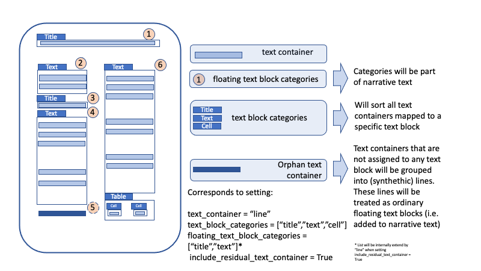

# Changing the layout parsing structure


This is a niche topic that you will need, if you train a layout detection model or sub layout detection model (cell in
tables, line items in invoices). If you want to use or fine-tune the pre-trained models can easily skip this section.

Let assume we've defined a pipeline for document parsing. The best way to analyze the results per page is
to use the `Page` class that works like a view to the raw objects collected by the pipeline.

```python

    df = pipeline.analyze(path="path/to/image_dir")
    df.reset_state()

    for dp in df:
       dp.layouts  # getting coarse layout blocks.
```


Layout structures are usually determined by a layout model. The model trained on *Publaynet* defines five different
layout structures. However, if we train a model that only detects tables we will need a way to customize the parsing
structure according to possible model outputs.
In other words: When analyzing complex structured documents you will be confronted with the question, on how to organize
the output from layout structures and its enclosed text.


```python3

    import os
    import deepdoctection as dd

    # setting up layout detector and layout service
    categories_layout = {"1": "text", "2": "title", "3": "list", "4": "table", "5": "figure"}

    layout_config_path = os.path.join(get_configs_dir_path(), "dd/tp/conf_frcnn_layout.yaml")
    layout_weights_path = "/path/to/dir/model-820000.data-00000-of-00001"
    d_layout = dd.TPFrcnnDetector("layout_tp", layout_config_path, layout_weights_path, categories_layout)
    layout = dd.ImageLayoutService(d_layout, to_image=True)

    # setting up OCR detector and ocr service
    ocr = dd.TextractOcrDetector(text_lines=True)
    text = dd.TextExtractionService(ocr)

    # setting up first two pipeline components
    pipe_comp =[layout,text]
```

&nbsp;

Next:

- You will have to assign word/text line to *Publaynet* layout structures.
- You will have to deal with words/text lines that cannot be assigned (because not all layout
  structures might have been discovered and therefore not every word/text line has been covered by some layout
  structure).
- You will have to infer a reading order on one hand side on the level within a
  layout structure  (e.g. text block) and on the other hand by ordering the different layout structures per page.
- When presenting text you need to think of what text blocks are part of the floating text, e.g. those text blocks
  that only together form a contiguous piece of text.
  Suppose you have text blocks and tables. Will it make sense to include table content into the contiguous text ?
  I think that tables should be separated from titles and text blocks.

The following diagram sets up the terminology we are going to use.



We have

- `text containers`: Objects that contain text on word/text line level and come with
                     surrounding bounding boxes. In general, they are `LayoutTypes.word`, `LayoutTypes.line`.
- `text_block`: Higher level text blocks (layout structures) that form an entity like a section or title. All text
                containers assigned to one text block will be sorted to give a contiguous block
                of text.
- `floating text blocks`: Sub set of text blocks. After ordering words within a text block,
                          floating text blocks themselves will be ordered as well to give contiguous
                          text of a page. Text blocks not belonging to floating text blocks will
                          not be considered.


## Matching Service

We now have to assign text lines to text blocks by looking at how do text lines overlap with
the underlying coarse structure. **deep**doctection provides a service to generate a hierarchy based
on parent categories (coarse layout sections), child categories and a matching rule according to which
a parental/child relationship will be established provided a given threshold has been exceeded.

```python3
    
    match = dd.MatchingService(
            parent_categories=["text",
                               "title",
                               "list",
                               "table"],
            child_categories="line",
            matching_rule="ioa",
            threshold=0.9
            )
    pipe_comp.append(match)
``` 

## Text order service


Determining the reading order of a text is done in two stages:

1. Ordering text within text blocks. Currently, text is assumed to be read
as in the Latin alphabet (i.e. line wise from top to bottom).

2. Ordering of floating text blocks.

It may happen that text containers are not assigned to text blocks. If
you do not want to lose any text, you can view unassigned text
containers as a floating text block and incorporate this block in the sorting
process (`text_containers_to_text_block=True`).

```python    
    text_order = dd.TextOrderService(text_container="line",
                                  floating_text_block_names=["text",
                                                             "title",
                                                             "list"],
                                  text_block_names=["text",
                                                    "title",
                                                    "list",
                                                    "table"],
                                  text_containers_to_text_block=True)
    pipe_comp.append(text_order)
```

## Page parsing

Now, that layout structures and text lines have been related and ordered it is now
time to create an output structure (`Page`) you can work with. When parsing
into the target structure you have to take into account what intrinsic structure you
have generated, and therefore you need to apply the previous setting when defining
text containers, text blocks etc.


```python
    
    page_parsing = dd.PageParsingService(text_container="line",
                                         floating_text_block_names=["text",
                                                                    "title",
                                                                    "list"],
                                         text_block_names=["text",
                                                           "title",
                                                           "list",
                                                           "table"],
                                         text_containers_to_text_block=True)
    pipe_comp.append(page_parsing)
    
    pipe = dd.DoctectionPipe(pipe_comp)
    
    path = "/path/to/dir/deepdoctection_images"
    df = pipe.analyze(path=path)
    
    for dp in df:
        print(dp.text)
``` 
