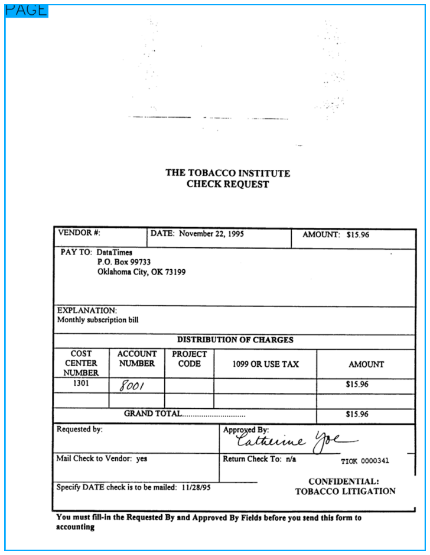
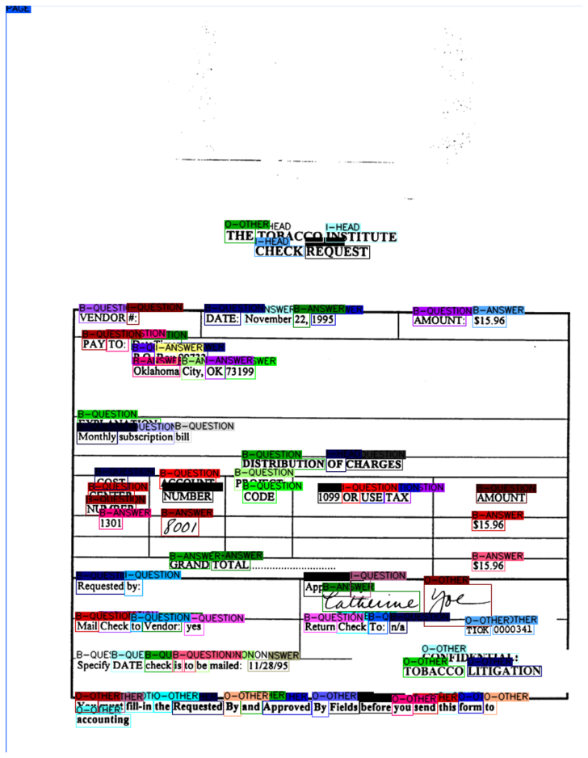

# LayoutLM for token classification

This tutorial is devoted to training, evaluation and setting up a
pipeline for token classification model with LayoutLM.

The individual steps differ only slightly from the tutorial on 
[LayoutLM for sequence classification](https://github.com/deepdoctection/notebooks/blob/main/Using_LayoutLM_for_sequence_classification.ipynb). 
Only a few details need to be changed.

We also show how to visualize and display the results.

For training and evaluation we use the [Funsd][deepdoctection.datasets.instances.funsd] dataset. To demonstrate the
inference pipeline, we use form samples from the [RVLCDIP][deepdoctection.datasets.instances.rvlcdip] dataset.

There is a [series](layoutlm_v1_on_custom_token_classification_notebook.md) of further tutorials on token classification with LayoutLM. There, a special dataset with special 
categories is used to show how training and evaluation can be started using W&B. The models LayoutLMv1, LayoutLMv2, 
LayoutXLM as well as LayoutLMv3 are treated there.

```python

    from transformers import LayoutLMTokenizerFast
    from matplotlib import pyplot as plt
    from tabulate import tabulate
    
    import deepdoctection as dd
```

```python

path_config_json = dd.ModelCatalog.get_full_path_configs("microsoft/layoutlm-base-uncased/pytorch_model.bin")
path_weights = dd.ModelCatalog.get_full_path_weights("microsoft/layoutlm-base-uncased/pytorch_model.bin")

dataset_train = dd.get_dataset("funsd")
dataset_train.dataflow.categories.filter_categories(categories=dd.LayoutType.WORD)

metric = dd.get_metric("f1")

# Token classes are saved for each word as token_tag sub category. Here we let the metric know
# where to look at when collecting prediction and ground truth.  
metric.set_categories(sub_category_names={"word": ["token_tag"]})
```

```python

    # decreasing batch size while increasing max steps will not change the model performance significantly
    dd.train_hf_layoutlm(path_config_json,
                         dataset_train,
                         path_weights,
                         config_overwrite=["max_steps=300",
                                           "per_device_train_batch_size=8",
                                           "eval_steps=100",
                                           "save_steps=100"],
                         log_dir="/path/to/dir",
                         dataset_val=dataset_train,
                         build_val_config=["split=test"],
                         metric=metric,
                         pipeline_component_name="LMTokenClassifierService")
```

```

    [0903 14:36.53 @maputils.py:205] Ground-Truth category distribution:
    |  category  | #box   |  category  | #box   |  category  | #box   |
    |:----------:|:-------|:----------:|:-------|:----------:|:-------|
    |  B-ANSWER  | 2802   |   B-HEAD   | 441    | B-QUESTION | 3266   |
    |  I-ANSWER  | 6924   |   I-HEAD   | 1044   | I-QUESTION | 4064   |
    |     O      | 3971   |            |        |            |        |
    |   total    | 22512  |            |        |            |        |

    
    You are using a model of type layoutlm to instantiate a model of type . This is not supported for all configurations of models and can yield errors.
    Some weights of the model checkpoint at /path/to/.cache/deepdoctection/weights/microsoft/layoutlm-base-uncased/pytorch_model.bin were not used when initializing LayoutLMForTokenClassification: ['cls.predictions.decoder.bias', 'cls.predictions.transform.LayerNorm.bias', 'cls.predictions.decoder.weight', 'cls.predictions.transform.LayerNorm.weight', 'cls.predictions.transform.dense.weight', 'cls.predictions.transform.dense.bias', 'cls.predictions.bias']
    - This IS expected if you are initializing LayoutLMForTokenClassification from the checkpoint of a model trained on another task or with another architecture (e.g. initializing a BertForSequenceClassification model from a BertForPreTraining model).
    - This IS NOT expected if you are initializing LayoutLMForTokenClassification from the checkpoint of a model that you expect to be exactly identical (initializing a BertForSequenceClassification model from a BertForSequenceClassification model).
    Some weights of LayoutLMForTokenClassification were not initialized from the model checkpoint at /path/to/.cache/deepdoctection/weights/microsoft/layoutlm-base-uncased/pytorch_model.bin and are newly initialized: ['classifier.weight', 'classifier.bias']
    You should probably TRAIN this model on a down-stream task to be able to use it for predictions and inference.
    max_steps is given, it will override any value given in num_train_epochs
    loading configuration file /path/to/.cache/deepdoctection/configs/microsoft/layoutlm-base-uncased/config.json
    You are using a model of type layoutlm to instantiate a model of type . This is not supported for all configurations of models and can yield errors.
    Model config PretrainedConfig {
      "_name_or_path": "microsoft/layoutlm-base-uncased",
      "attention_probs_dropout_prob": 0.1,
      "hidden_act": "gelu",
      "hidden_dropout_prob": 0.1,
      "hidden_size": 768,
      "initializer_range": 0.02,
      "intermediate_size": 3072,
      "layer_norm_eps": 1e-12,
      "max_2d_position_embeddings": 1024,
      "max_position_embeddings": 512,
      "num_attention_heads": 12,
      "num_hidden_layers": 12,
      "output_past": true,
      "pad_token_id": 0,
      "position_embedding_type": "absolute",
      "transformers_version": "4.19.4",
      "type_vocab_size": 2,
      "use_cache": true,
      "vocab_size": 30522
    }
    

```
```
    Saving model checkpoint to /path/to/Tests/Token_classification/checkpoint-300
    Configuration saved in /path/to/Tests/Token_classification/checkpoint-300/config.json
    Model weights saved in /path/to/Tests/Token_classification/checkpoint-300/pytorch_model.bin


    [0903 14:38.40 @accmetric.py:340] F1 results:
    |    key    | category_id   | val      | num_samples   |
    |:---------:|:--------------|:---------|:--------------|
    | token_tag | 1             | 0.856124 | 821           |
    | token_tag | 2             | 0.606557 | 122           |
    | token_tag | 3             | 0.87206  | 1077          |
    | token_tag | 4             | 0.812651 | 2544          |
    | token_tag | 5             | 0.543333 | 257           |
    | token_tag | 6             | 0.772786 | 1594          |
    | token_tag | 7             | 0.746672 | 2558          |
```


To get more information of the distribution output we evaluate the
trained model by using a confusion matrix.

```python

    path_config_json = "/path/to/dir/checkpoint-300/config.json"
    path_weights = "/path/to/dir/checkpoint-300/pytorch_model.bin"
    
    
    categories = dataset_train.dataflow.categories.get_sub_categories(categories="word",
                                                                      sub_categories={"word":
                                                                                      ["token_tag"]},
                                                                      keys=False)["word"]["token_tag"]
    
    metric = dd.get_metric("confusion")
    metric.set_categories(sub_category_names={"word": ["token_tag"]})
    layoutlm_classifier = dd.HFLayoutLmTokenClassifier(path_config_json,
                                                       path_weights,
                                                       categories=categories)
    
    tokenizer_fast = LayoutLMTokenizerFast.from_pretrained("microsoft/layoutlm-base-uncased")
    pipe_component = dd.LMTokenClassifierService(tokenizer_fast,
                                                 layoutlm_classifier,
                                                 use_other_as_default_category=True)
    
    evaluator = dd.Evaluator(dataset_train, pipe_component, metric)
    _ = evaluator.run(split="test")

```

```

    Confusion matrix: 
    |    predictions ->  |   1 |   2 |   3 |    4 |   5 |    6 |    7 |
    |     ground truth | |     |     |     |      |     |      |      |
    |                  v |     |     |     |      |     |      |      |
    |-------------------:|----:|----:|----:|-----:|----:|-----:|-----:|
    |                  1 | 720 |   3 |  25 |   33 |   0 |    6 |   34 |
    |                  2 |   2 |  74 |  34 |    0 |   3 |    1 |    8 |
    |                  3 |  37 |  23 | 927 |   14 |  10 |   20 |   46 |
    |                  4 |  55 |   0 |  10 | 2017 |   9 |  102 |  351 |
    |                  5 |   2 |   7 |   1 |   12 | 163 |   29 |   43 |
    |                  6 |   1 |   0 |  22 |   99 |  30 | 1187 |  255 |
    |                  7 |  44 |  15 |  30 |  245 | 128 |  133 | 1963 |
```

## Building a production pipeline

```python

    def get_layoutlm_pipeline():
        path_config_json = "/path/to/dir/checkpoint-300/config.json"
        path_weights = "/path/to/dir/checkpoint-300/pytorch_model.bin"

        path_weights_tl = dd.ModelDownloadManager.maybe_download_weights_and_configs("doctr/db_resnet50/pt/db_resnet50-ac60cadc.pt")
        categories_tl = dd.ModelCatalog.get_profile("doctr/db_resnet50/pt/db_resnet50-ac60cadc.pt").categories
        text_line_predictor = dd.DoctrTextlineDetector("db_resnet50", path_weights_tl, categories_tl, "cpu", "PT")

        layout_component = dd.ImageLayoutService(text_line_predictor, to_image=True, crop_image=True)
        
        
        path_weights_tr = dd.ModelDownloadManager.maybe_download_weights_and_configs("doctr/crnn_vgg16_bn/pt/crnn_vgg16_bn-9762b0b0.pt")
        text_recognizer = dd.DoctrTextRecognizer("crnn_vgg16_bn", path_weights_tr, "cpu", "PT")
        text_component = dd.TextExtractionService(text_recognizer, extract_from_roi="word")
    
        layoutlm_token_classifier = dd.HFLayoutLmTokenClassifier(path_config_json,
                                                              path_weights,
                                                              categories={
                                                                  "1": "B-answer",
                                                                  "2": "B-header",
                                                                  "3": "B-question",
                                                                  "4": "I-answer",
                                                                  "5": "I-header",
                                                                  "6": "I-question",
                                                                  "7": "O"
                                                              })
    
        tokenizer_fast = LayoutLMTokenizerFast.from_pretrained("microsoft/layoutlm-base-uncased")
        layoutlm_component = dd.LMTokenClassifierService(tokenizer_fast,
                                                         layoutlm_token_classifier)
        
        # adding a text order service to get an arrangment of words from top to bottom and left to right.
        reading_order = dd.TextOrderService(text_container="word")
    
        return dd.DoctectionPipe(pipeline_component_list=[layout_component, text_component, layoutlm_component, reading_order])
```

```python

    path = "/path/to/.cache/deepdoctection/datasets/rvl/image"
    
    layoutlm_pipeline = get_layoutlm_pipeline()
    df = layoutlm_pipeline.analyze(path= path)
    df_iter = iter(df)
```

```python

    dp = next(df_iter)
```

```
    [0903 14:56.12 @doctectionpipe.py:101]processing 00000341_00000343.png
    [0903 14:56.13 @context.py:131]ImageLayoutService finished, 0.8441 sec.
    [0903 14:56.13 @context.py:131]TextExtractionService finished, 0.5459 sec.
    [0903 14:56.13 @context.py:131]LMTokenClassifierService finished, 0.0309 sec.
    [0903 14:56.13 @context.py:131]TextOrderService finished, 0.0023 sec.
```

```python

    plt.figure(figsize = (25,17))
    plt.axis('off')
    plt.imshow(dp.viz(show_words=True))
```




```python

    plt.figure(figsize = (25,17))
    plt.axis('off')
    plt.imshow(dp.viz(show_words=True))
```



```python

word_list = dp.words
word_list.sort(key=lambda x: x.READING_ORDER)
output = [["#", "LABEL"]]
for word in word_list:
    output.append([word.CHARACTERS, word.TOKEN_CLASS + "-" + word.TAG])

print(tabulate(output, headers="firstrow"))
```

```

    #              LABEL
    -------------  ----------
    INSTITUTE      header-I
    TOBACCO        header-I
    THE            other-O
    REQUEST        header-B
    CHECK          header-I
    $15.96         answer-B
    AMOUNT:        question-B
    1995           answer-B
    22,            answer-B
    November       answer-B
    DATE:          question-B
    VENDOR         question-B
    #:             question-I
    DataTimes      question-I
    TO:            question-B
    PAY            question-B
    99733          answer-I
    Box            answer-I
    P.O.           question-B
    73199          answer-B
    City,          answer-B
    OK             answer-I
    Oklahoma       answer-B
    EXPLANATION:   question-B
    subscription   question-B
    Monthly        question-B
    bill           question-B
    CHARGES        question-B
    DISTRIBUTION   question-B
    OF             header-I
    PROJECT        question-B
    ACCOUNT        question-B
    COST           question-B
    AMOUNT         question-B
    TAX            question-B
    USE            question-B
    OR             question-I
    1099           question-B
    CODE           question-B
    NUMBER         question-B
    CENTER         question-B
    NUMBER         question-B
    $15.96         answer-B
    8001           answer-B
    1301           answer-B
    $15.96         answer-B
    TOTAL.         answer-B
    GRAND          answer-B
    Approyed       question-B
    By:            question-I
    Requested      question-B
    by:            question-I
    tatkuine       answer-B
    ye             other-O
    TIOK           other-O
    0000341        other-O
    yes            question-B
    Return         question-B
    n/a            question-B
    To:            question-B
    Check          question-B
    Vendor:        question-B
    to             question-B
    Check          question-B
    Mail           question-B
    CONFIDENTIAL:  other-O
    11/28/95       answer-B
    LITIGATION     other-O
    TOBACCO        other-O
    Specify        question-B
    mailed:        question-B
    to             question-B
    check          question-B
    DATE           question-B
    be             question-B
    is             question-B
    you            other-O
    send           other-O
    before         other-O
    Approved       other-O
    Requested      other-O
    to             other-O
    form           other-O
    this           other-O
    Fields         other-O
    By             other-O
    By             other-O
    must           other-O
    and            other-O
    the            other-O
    fill-in        other-O
    You            other-O
    accounting     other-O
```

```python

    dp = next(df_iter)
```

```
    [0903 14:58.46 @doctectionpipe.py:101]processing 00001057.png
    [0903 14:58.46 @context.py:131]ImageLayoutService finished, 0.8165 sec.
    [0903 14:58.47 @context.py:131]TextExtractionService finished, 0.37 sec.
    [0903 14:58.47 @context.py:131]LMTokenClassifierService finished, 0.0289 sec.
    [0903 14:58.47 @context.py:131]TextOrderService finished, 0.0018 sec.
```

```python

    plt.figure(figsize = (25,17))
    plt.axis('off')
    plt.imshow(dp.viz())
```

[](./_imgs/layoutlm_token_classification_3.png)


```python

    plt.figure(figsize = (25,17))
    plt.axis('off')
    plt.imshow(dp.viz(show_words=True))
```

[](./_imgs/layoutlm_token_classification_4.png)

```python

word_list = dp.words
word_list.sort(key=lambda x: x.READING_ORDER)
output = [["#", "LABEL"]]
for word in word_list:
    output.append([word.CHARACTERS, word.TOKEN_CLASS + "-" + word.TAG])

print(tabulate(output, headers="firstrow"))
```

```

    #             LABEL
    ------------  ----------
    ISTITUTE      other-O
    TOBACCO       other-O
    THE           other-O
    w             other-O
    ili           other-O
    r/"           other-O
    REQUEST       header-B
    CHECK         header-I
    Traas         other-O
    Amount:       question-B
    $3.750        answer-B
    Date.         question-B
    1984          answer-B
    6,            answer-B
    December      answer-B
    Pay           question-B
    To:           question-I
    Nance         answer-B
    Ken           answer-B
    Explanation   other-O
    1984          answer-B
    A             answer-B
    -             answer-B
    Ocrohar1.     answer-B
    of            answer-I
    Rerainad      answer-I
    1985          answer-B
    for           answer-B
    lobbyist      answer-I
    Nev           answer-B
    paymant       question-I
    IEPIRNE       answer-B
    198A          answer-B
    for           answer-B
    k             answer-B
    fes           answer-B
    This          other-O
    CHARGES       question-B
    DISTRIBUTION  question-B
    OF            question-I
    Account       question-B
    Center        question-B
    Cost          question-B
    Number        question-B
    Amount        question-B
    Explanation   question-B
    Number        question-B
    $3,750.00     other-O
    6000          answer-B
    1401          answer-B
    Approved      question-B
    by:           question-B
    Requested     question-B
    Hurst         answer-B
    A             other-O
    me            question-B
    tranamittal   question-B
    to            question-B
    check         question-B
    Return        question-B
    mail          question-B
    check         question-B
    for           question-B
    In            question-B
    Put           question-B
    a             other-O
    D             answer-B
    Ehg           other-O
    by:           question-B
    Need          question-B
    asap          other-O
    TIOK          other-O
    0027860       other-O
```


